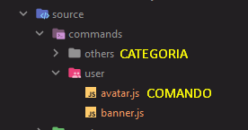
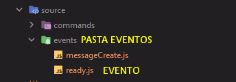

# 🤖 Source Code Discord Bot

Decidi disponibilizar essa base para ajudar as pessoas que querem construir um Bot com mais facilidade, realizei a leitura da documentação e implementei nesse projeto para que facilite a vida de muitos.

OBS: Antes de tudo instale o Node.JS em seu computador. É necessário que você já entenda como criar a aplicação de um Bot no Discord Developers, será necessário dos valores **TOKEN DO BOT**, **CLIENT_ID**, **GUILD_ID**.

### Comandos já criados

Atualmente no projeto já existem os comandos **avatar** e **banner**, onde a responsabilidade desses comandos é de pegarem sua imagem de avatar ou a imagem do seu banner.

### Controladores

Controlador de Comandos (Com subcategorias)

Controlador de eventos

### Explicação de como um comando funciona

Os comandos possuem algumas propriedades na sua exportação.
- **name**: Nome do seu comando
- **description**: Descrição do seu comando
- **cooldown**: Tempo de espera do usuário para repetir o comando
- **args**: Aqui você colocará **true** caso seu comando possua argumentos (``!talcoisa oi``) e **false** caso não.

# ⚙️ Instalação e Scripts

Clone o repositório para o seu computador:

``git clone https://github.com/argondc/discord-bot.git``

Obrigatório renomear o arquivo **.env.example** para **.env**, após configure de acordo com suas necessidades.

Caso utilize Linux ou outro sistema operacional: 

``cp .env.example .env``

Instale as dependências `` npm install ``, se você utiliza **yarn** assim como eu `` yarn install``

### Nodemon

Se você não sabe para que serve a dependência Nodemon, resumidamente é para não ter que ficar salvando arquivos e executando o script toda vez que haver modificações, então simplesmente podemos rodar o comando ``yarn run dev`` isso irá fazer o Nodemon escutar seus arquivos e a cada mudança terá um reload na execução.

### Eslint

A dependência Eslint foi aplicada ao projeto com o arquivo **.eslintrc.json** com as regras de acordo com a documentação do Discord.js Guide, facilitando o desenvolvimento do seu Bot com boas práticas.

# 🎲 Dependências

| Necessárias                 | Desenvolvimento |
|-----------------------------|-----------------|
| @discordjs/builders ^0.13.0 | Eslint ^8.16.0  |
| @discordjs/rest ^0.4.1      | Nodemon ^2.0.16 |
| ansi-colors ^4.1.3          |                 |
| axios  ^0.27.2              |                 |
| discord-api-types ^0.33.0   |                 |
| discord.js   ^13.7.0        |                 |
| dotenv    ^16.0.1           |                 |

Fique a vontade para contribuir com o projeto, caso tenha alguma mudança específica, poderá realizar merge request e seu código será analisado. Se existir algum problema no projeto, cria uma solicitação na aba Issues do Github.